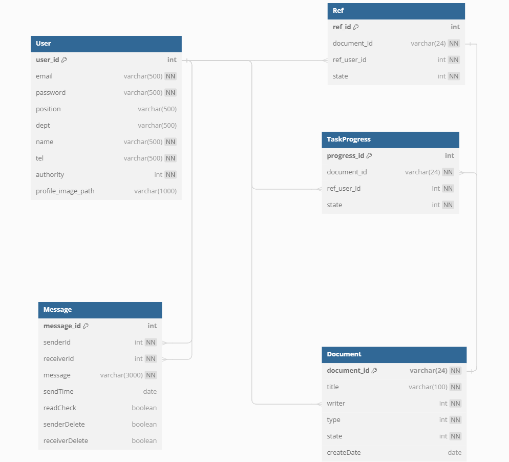
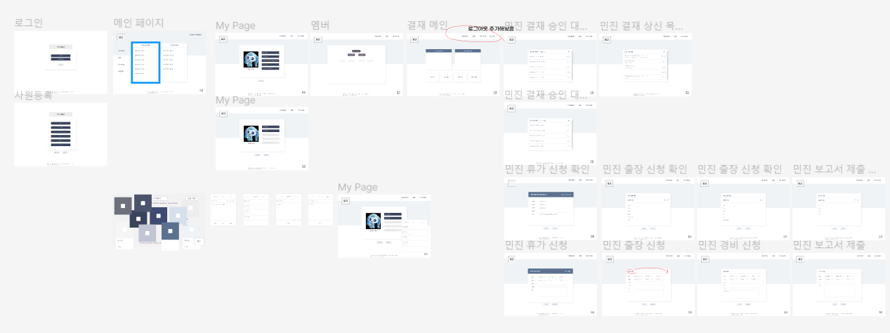

# (주)위계질서

FEAT. 동치미회사

Welcome to 동치미회사 👋

## 기획 의도

## 팀원 소개

| 김융&nbsp;&nbsp;                  | 유민진&nbsp;&nbsp;                                  | 서주원                                                                                                                                                                                                     | 이경석                                                                                                                                                                                                                                                                                                          | 안슬기 &nbsp;&nbsp; | 최병민 &nbsp;&nbsp;                                                                                                                            |
| ------------------------------------------------------------------------------------------------------------------------------------------------------------ | --------------------------------------------------------------------------------------------------------------------------------------------------------------------------- | ---------------------------------------------------------------------------------------------------------------------------------------------------------------------------------------------------------- | --------------------------------------------------------------------------------------------------------------------------------------------------------------------------------------------------------------------------------------------------------------------------------------------------------------- | ------------------------------------------------------------------------------------------------------------------------- | ----------------------------------------------------------------------------------------------------------------------------------------------------------------------------------------------------------------------------------------------- |
| 프론트엔드                                                                                                                                                   | 프론트엔드                                                                                                                                                                  | 백엔드                                                                                                                                                                                                     | 백엔드                                                                                                                                                                                                                                                                                                          | 프론트엔드  백엔드                                                                                                     | 백엔드                                                                                                                                                                                                                                          |
| 1. 화면 구현   - 결재 메인   - 신청서   - 결재 대기 목록   2. JS 작업   3. 프론트 연동 작업   - 마이페이지   - 사원등록   - 로그아웃 | 1. 전반적 퍼블리싱 제작   2. 화면구현   - 로그인   - 사원 등록   - 내 정보   - 내 정보 수정   - 쪽지 모달   3. 모달 페이지 관련 JS   4. 로고 디자인 | 1. Spring Security를 활용한 로그인, 로그아웃 기능   2. 마이페이지 및 내 정보 수정 기능   3. 사원 회원 가입 기능   4. 프론트/백 연동 작업   - 마이페이지   - 사원등록   - 로그인/로그아웃 | 1. DB ERD 설계 및 DB서버 구축   2. FrontEnd Node.js 서버 구축   3. 결재 시스템 기능 구현(JS 포함)   - 결재 문서 작성   - 상세 페이지 조회   - 결재, 반려 기능   - 임시 저장 시스템   4. 네이버 클라우드 활용 프로필 이미지 삽입   5. 백엔드 프론트엔드 네이버 클라우드 플랫폼 서버 배포 | 1. 프론트 공통 퍼블리싱 제작   2. 나의 신청 목록 기능 백, 프론트 담당   3. 대기중인 목록 기능 백, 프론트 담당       | 1. 조직도 그래프 API   2. 나의 부서 연락망   3. 쪽지 관련 기능   - 결재 문서 작성 기능   - 받은/보낸 쪽지함   - 무한 스크롤   - 쪽지 내용 가져오기   - 쪽지 확인 및 삭제   - 새로운 쪽지 알림   4. 쪽지 관련 연동 JS |

## 프로젝트 구조

-   node.js 18.04

-   Java 17
-   Spring boot 3.2.5

-   mongoDB 4.2
-   mariaDB LTS

## 프로젝트 기간

2024.5.2 ~ 2024.5.16(14일)

## ERD

### MariaDB ERD

-   User : 사용자 정보 테이블
-   Message : 쪽지 내역 테이블
-   Ref : 문서 결재 완료, 참조, 반려 정보 테이블
-   TaskProgress : Ref 테이블과 데이터는 같으나 결재가 진행 중인 정보. 삭제와 삽입이 반복되는 특징을 가져서 테이블 분리
-   Document : 결재 문서 메타 데이터 테이블

### MongoDB ERD

-   휴가, 출장, 보고서, 경비 결재 문서가 각기 다른 스키마로 한 컬렉션 내부에 저장됨

### 페이지 설계

## 페이지 구성
